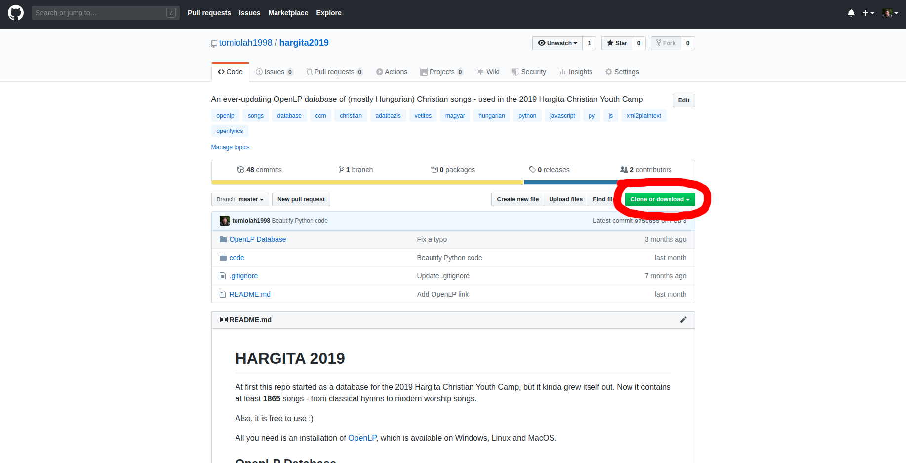
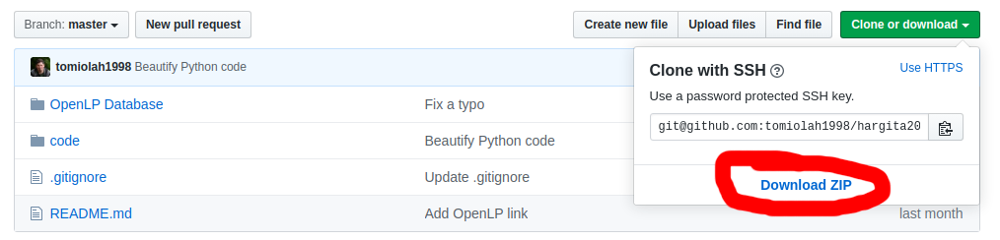
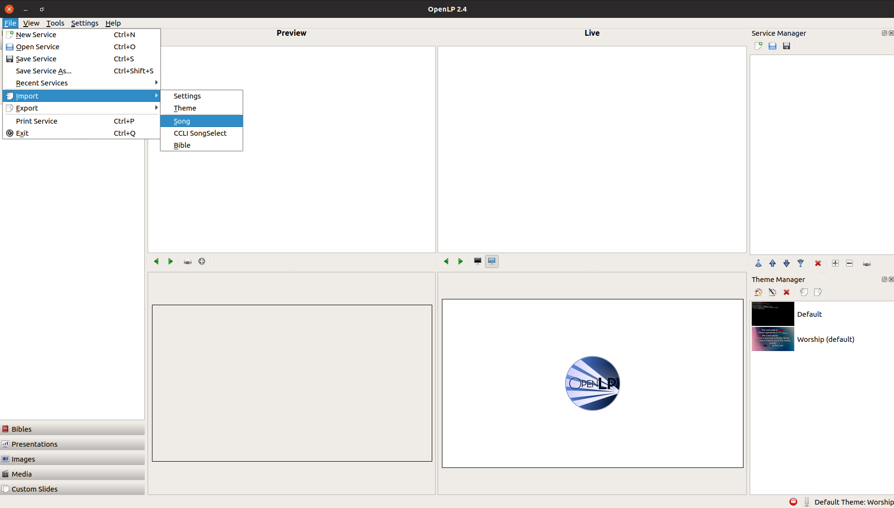
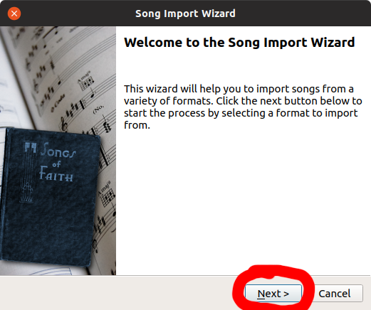
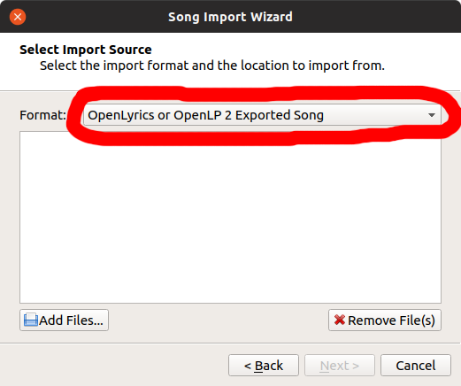
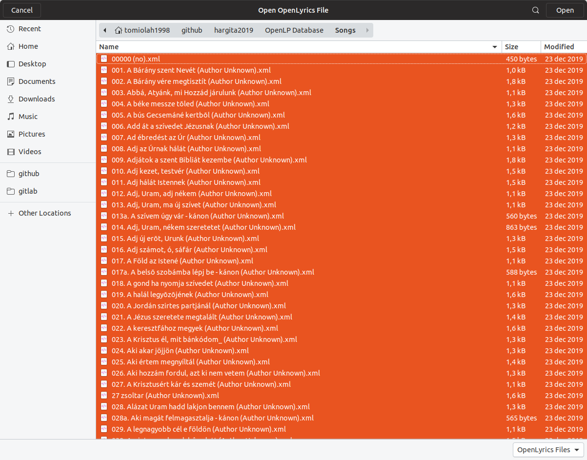
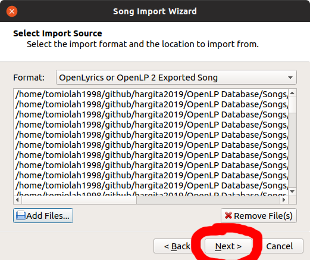
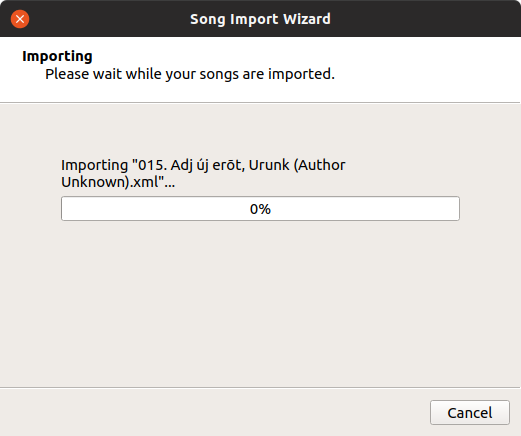
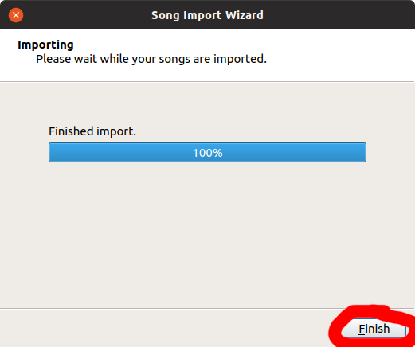

# HARGITA 2019

At first this repo started as a database for the 2019 Hargita Christian Youth Camp, but it kinda grew itself out. Now it contains at least **1865** songs - from classical hymns to modern worship songs.

Also, it is free to use :)

All you need is an installation of [OpenLP](https://openlp.org/), which is available on Windows, Linux and MacOS.

## OpenLP Database

In the folder `OpenLP Database/Songs` you can find a continuously updating database of Christian songs (mostly in Hungarian). Every song is in the OpenXML format (`*.xml`), that can be imported in OpenLP.

Here are other file formats that you may encounter in the `OpenLP Database` folder:
- `*.osz` - this is an OpenLP Schedule file, with a list of songs, that was / will be selected on a service / gathering
- `*.conf` - this is an OpenLP configuration file - do not import it, if you're not sure about what you are doing, as it can break OpenLP, and it might have to be reinstalled
- `*.otz` - this is an OpenLP Theme file, containing Background Image, Font info and Text Arrangement configuration - you can import and apply these in the Theme Chooser panel of OpenLP

## Plaintext

If you want the lyrics from the XML files in plaintext, there is a convenient Python3 script provided in the `code/xml2plaintext` folder - to use it, just run `python3 main.py`. This will regenerate the plaintext (`*.txt`) files in the `code/xml2plaintext/output` folder, based on the files in the `OpenLP Database/Songs` folder

For now, the script only works on Linux and MacOS (it uses the `find` command with Python's `os.popen()` function), but feel free to add Windows support, too. :)

Until then, you can find some songs that are generated, in the `code/xml2plaintext/output` folder - but I can't guarantee, that it is always up-to-date

# [HU] ADATBÁZIS HOZZÁADÁSA OPENLP-HEZ

1. Telepítsük az OpenLP-t a hivatalos weboldalról: [https://openlp.org/](https://openlp.org/)

    **FIGYELEM:** telepítéskor az OpenLP felajánlja, hogy létrehozzon egy adatbázist közismert angol, és más nyelvű egyházi énekekkel, viszont ez sok esetben nem indokolt. Figyeljünk oda a telepítőre!

2. Töltsük le ezt a repót:

    a. Webes interfész:
      

      

      - Csomagoljuk ki a letöltött ZIP-et (`<repo>`)

    b. Command Line (szükséges a `git`):
      `git clone https://github.com/tomiolah1998/hargita2019`

3. Nyissuk meg az OpenLP-t

4. Navigáljunk a File > Import > Song menüpontra:

  **FIGYELEM:** ha egy ének már jelen van az adatbázisban, és mégegyszer hozzáadjuk, akkor az az ének duplikáltan fog megjelenni - ajánlott, hogy töröljük előbb az adatbázisból azokat az énekeket, melyeket frissíteni / újra hozzáadni szeretnénk.

5. A megjelent ablakban navigálunk tovább

    

    

    

    Itt navigáljunk a letölltött repóban a következő útvonalra:
    `<repo>/OpenLP Database/Songs/`

    Ebből a mappából adjunk hozzá minden éneket (XML állományok)

    

    

    

    Várjuk meg, amíg minden ének hozzáadásra kerül, majd kattintsunk a "Finish" gombra:

    

6. Kész 😃
